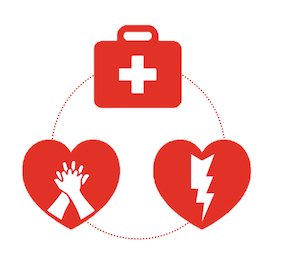
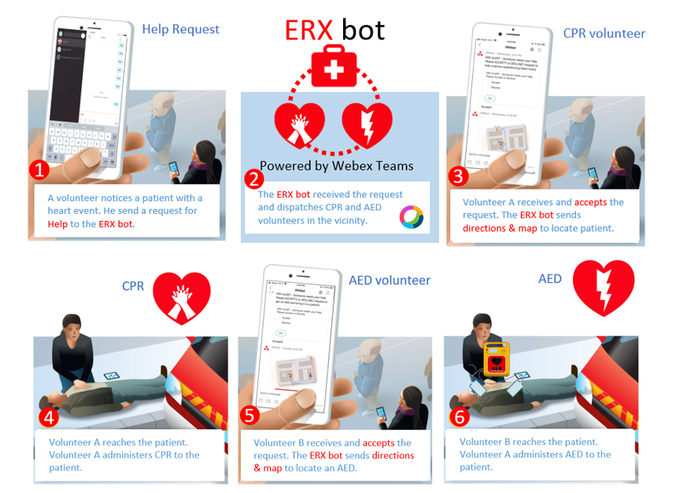
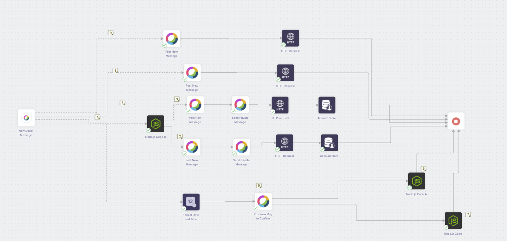
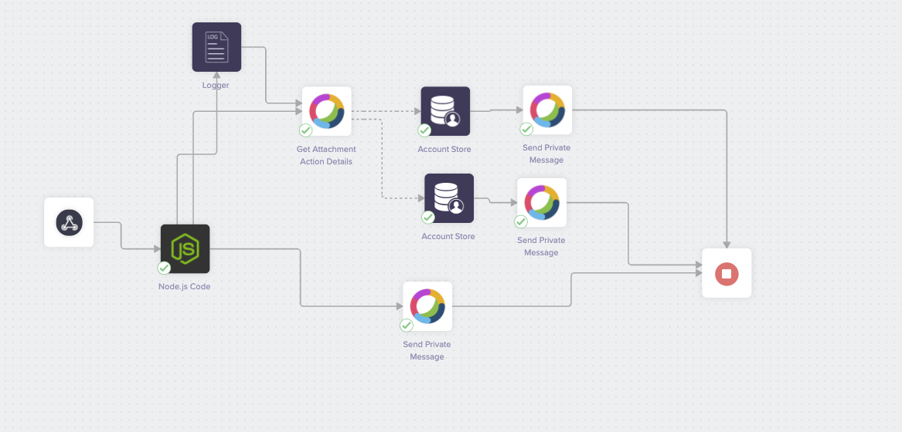
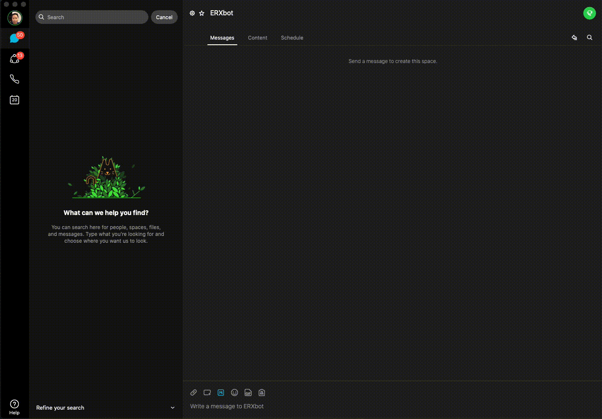

# ERX Project



Public Safety Application: Emergency Response Express (ERX)
Making more Corporate Canadians ready to respond faster to a cardiac emergency with Cardiopulmonary Resuscitation (CPR) and/or Automated External Defibrillator (AED).

When a stroke or cardiac arrest occurs, getting the right care fast is critical. Each minute without oxygen and blood flow to the brain increases the risk of permanent damage and death.  Every second counts.

Each year, an estimated 40,000 cardiac arrests occur in Canada. The vast majority happen in public places or at home, and few people survive. But survival rates double if someone performs CPR and uses an automated external defibrillator (AED).

## Contacts:
* Samantha Yiu (sayiu@cisco.com)
* Jason Chung-Tung (jchungtu@cisco.com)
* Jason Mah (jamah@cisco.com)

# Solution Details

The ERX Project finds the right resources for the patient as quickly as possible to increase the chances of survival.  The solution utilizes the real-time communication of Webex Teams along with Meraki's Dashboard APIs to locate and notify the resources necessary to provide CPR and the AED device.



The Team leveraged the capabilities of [built.io flow](https://www.built.io/)  to connect, integrate and automate the workflow.  The app listens for keyword from a volunteer's device then checks the Webex Teams username against the Meraki SSID client list for that same username.  It will then notify the volunteers on the same Meraki AP with the patient's originating SSID.  The assumption is that any volunteer associated to that AP will be in the vicinity of the patient.



Once the inital notications for volunteers are sent, the second flow waits for a response from the volunteers would can assist with CPR and the AED.  Information from the initial workflow is sent to this second workflow.  Once the volunteers accept the requests, a map is sent to their devices to show them their optimal path to the person in distress.




# Solution Components
* Webex Teams
* Meraki
* Built.io
* HTML
* Node.js


# Installation

Search and add the ERX Webex Teams Bot onto each device.  



# Usage

To launch the service, the user needs to request "Help" from the ERX Webex Teams Bot.

```bash
Help
```

Below is a demo of the solution which utilizes three devices, one for the volunteer that requests for help on behalf of the patient in distress (Leonard), the second is the nearest volunteer to perform CPR (Sheldon) and finally the closest volunteer to the AED device and patient (Penny).


Please contact one of us if you have any comments/questions and would like to leverage the built.io workflows.

## License

Provided under Cisco Sample Code License, for details see [LICENSE](./LICENSE)

## Code of Conduct

Our code of conduct is available [here](./CODE_OF_CONDUCT.md)

## Contributing

See our contributing guidelines [here](./CONTRIBUTING.md)

### DISCLAIMER:
<b>Please note:</b> This script is meant for demo purposes only. All tools/ scripts in this repo are released for use "AS IS" without any warranties of any kind, including, but not limited to their installation, use, or performance. Any use of these scripts and tools is at your own risk. There is no guarantee that they have been through thorough testing in a comparable environment and we are not responsible for any damage or data loss incurred with their use.
You are responsible for reviewing and testing any scripts you run thoroughly before use in any non-testing environment.
